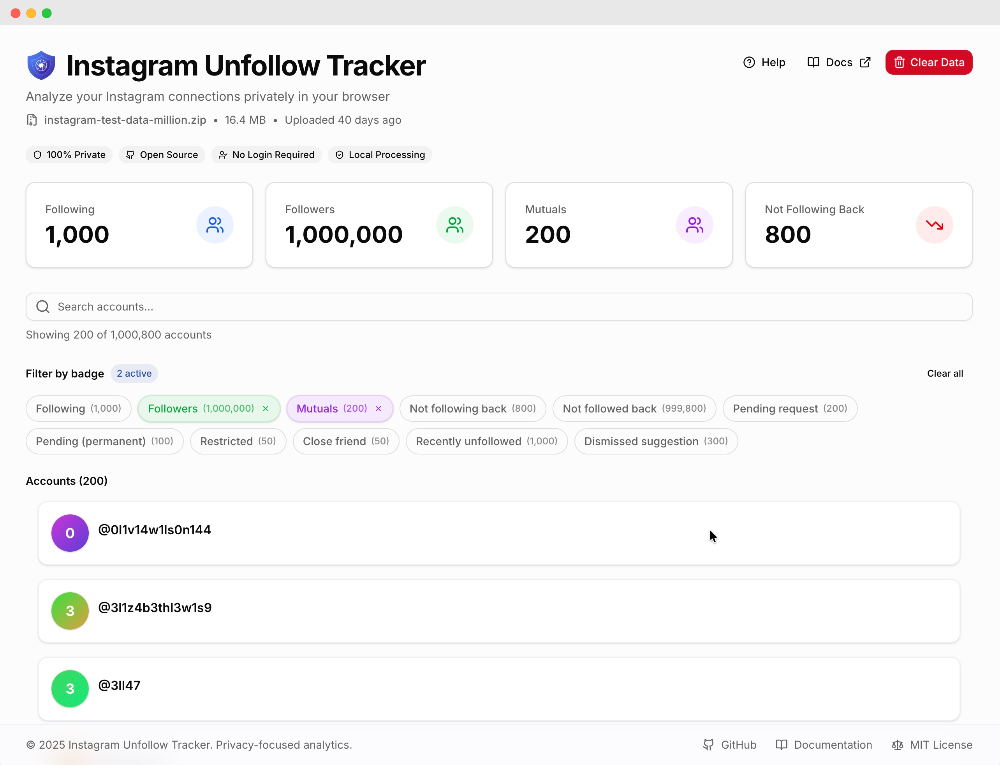
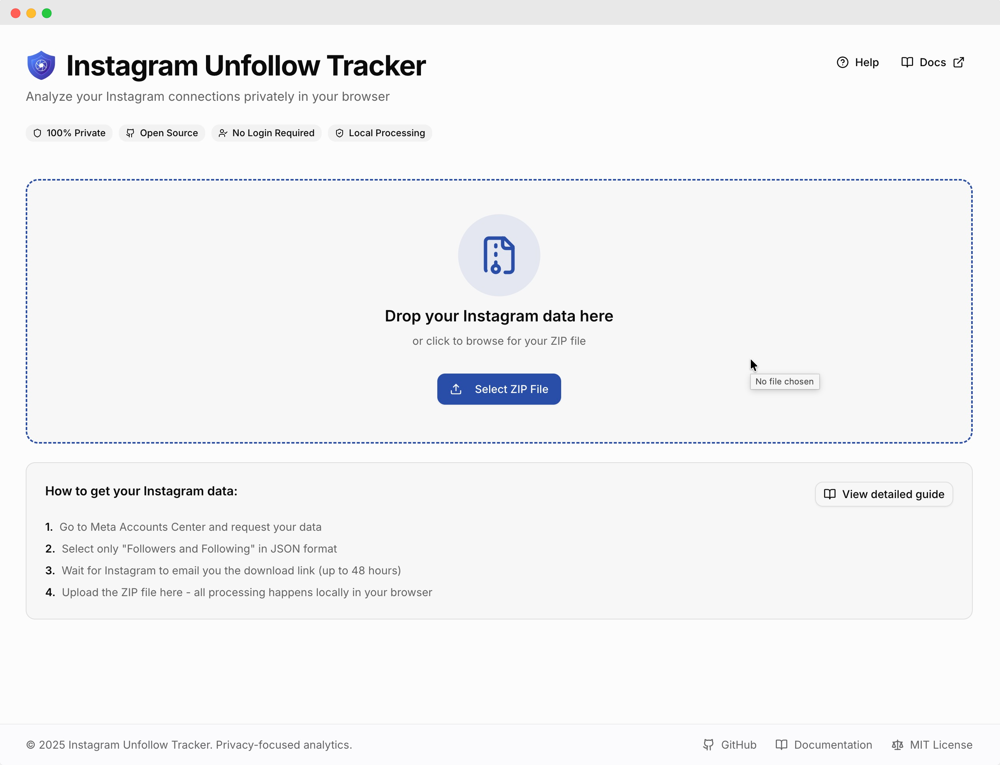
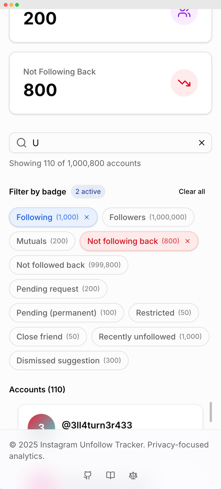
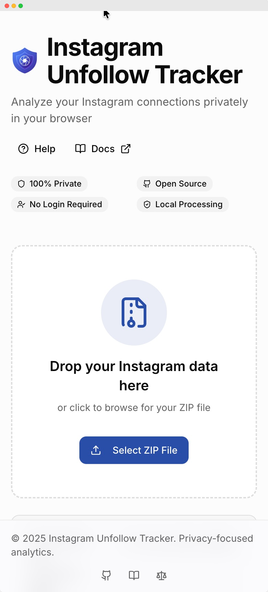
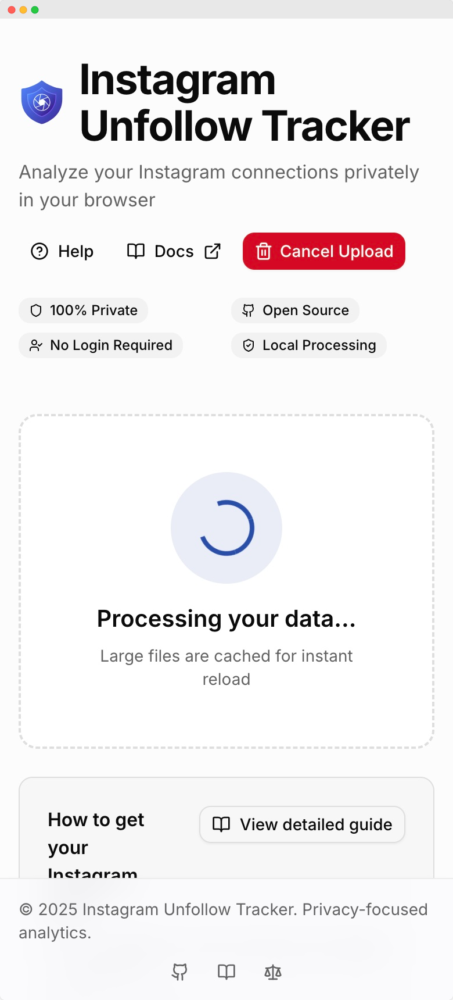

<div align="center">
  
  <h1>Instagram Unfollow Tracker</h1>
</div>

<br>


<div align="left">
    <a href="https://www.producthunt.com/products/instagram-unfollow-tracker?embed=true&utm_source=badge-featured&utm_medium=badge&utm_source=badge-instagram&#0045;unfollow&#0045;tracker" target="_blank">
        
    </a>
</div>

<br>

**Find out who unfollowed you on Instagram** — analyze your Instagram Data Download ZIP locally to discover mutuals, non-mutuals, and connection patterns. No login, no servers, no tracking.

## 🎯 What it does

Upload your Instagram data export and instantly see:

- **Who unfollowed you** — accounts that stopped following you
- **Who you follow but doesn't follow back** — one-way connections
- **Mutual followers** — accounts you both follow
- **Connection patterns** — understand your Instagram network

All processing happens **100% locally** in your browser. Your data never leaves your device.

## 📸 Screenshots

<div align="center">
  
  <p><em>Full interface with filtering, search, and account list</em></p>
</div>

<div align="center">
  
  <p><em>Drag and drop your Instagram ZIP file to get started</em></p>
</div>

<details>
<summary>📱 <strong>View Mobile Screenshots</strong></summary>

<div align="center">
  
  <p><em>Responsive mobile interface</em></p>
</div>

<div align="center">
  
  <p><em>Mobile file upload</em></p>
</div>

<div align="center">
  
  <p><em>Fast processing with progress indicator</em></p>
</div>

</details>

## ✨ Key Features

- 🔍 **Find unfollowers** — see exactly who stopped following you
- 🔄 **Mutual analysis** — discover who follows you back vs. one-way connections
- 🏷️ **Smart badges** — Following, Followers, Mutuals, Not following back, Not followed back, Pending, Restricted, Close friends, Unfollowed, Dismissed
- 🔎 **Lightning-fast search** — trigram/prefix indexes for instant results (even with 1M+ accounts)
- ⚡ **Optimized for scale** — handles millions of accounts with <5MB memory usage
- 📱 **Responsive design** — works perfectly on desktop and mobile
- 🌙 **Dark mode** — comfortable viewing in any lighting
- 💾 **Smart caching** — instant reload with IndexedDB persistence
- 📊 **Sample data** — try it without uploading your own data
- 🌍 **10 languages** — English, Spanish, Russian, German, Portuguese, Turkish, Hindi, Indonesian, Japanese, Arabic (RTL)
- 📲 **PWA support** — install as app, works fully offline
- 🛡️ **Error recovery** — graceful error handling with recovery options

## 🌍 Multilingual Support

Available in **10 languages** with full RTL support:

| Language         | Code | RTL |
| ---------------- | ---- | --- |
| English          | en   | —   |
| Español          | es   | —   |
| Русский          | ru   | —   |
| Deutsch          | de   | —   |
| Português        | pt   | —   |
| Türkçe           | tr   | —   |
| हिन्दी           | hi   | —   |
| Bahasa Indonesia | id   | —   |
| 日本語           | ja   | —   |
| العربية          | ar   | ✅  |

- **80 pre-rendered pages** — SSG for instant load and SEO
- **Dynamic meta tags** — localized titles/descriptions per language
- **Browser language detection** — auto-redirects to preferred language

## 🚀 Why choose this over paid tools?

| Feature             | Instagram Unfollow Tracker | Paid Apps (Unfollowgram, etc.) |
| ------------------- | -------------------------- | ------------------------------ |
| **Price**           | 💰 Free forever            | 💸 $5-10/month                 |
| **Privacy**         | 🔒 100% local (no upload)  | ⚠️ Upload to cloud servers     |
| **Instagram Login** | ✅ Not required            | ❌ Required (risky!)           |
| **Account Limit**   | ✅ Unlimited (1M+ tested)  | ⚠️ 10k-100k max                |
| **Data Processing** | ⚡ 5ms (1M accounts)       | 🐌 150ms+                      |
| **Offline Mode**    | ✅ Works offline           | ❌ Requires internet           |
| **Open Source**     | ✅ MIT license             | ❌ Closed source               |
| **Ads/Tracking**    | ✅ None                    | ⚠️ Usually present             |
| **Platform**        | 🌐 Web (all devices)       | 📱 Mobile apps usually         |

### Why This Matters

- **🔒 100% Private** — all processing happens locally in your browser (IndexedDB)
- **💰 Completely Free** — no subscriptions, no hidden costs, no limits
- **🔓 Open Source** — transparent code you can audit and customize
- **⚡ Fast & Offline** — works without internet, 75x faster filtering than competitors
- **🛡️ No Account Risk** — no Instagram login required, respects platform rules
- **🎯 Accurate Results** — clear mutual/non-mutual detection without gimmicks
- **📈 Scales to millions** — handles 1M+ accounts with ease (vs 100k limit in paid apps)

## 🚀 Quick Start

### Try it online

Visit the live demo: **[safeunfollow.app](https://safeunfollow.app)**

### Run locally

```bash
git clone https://github.com/ignromanov/instagram-unfollow-tracker.git
cd instagram-unfollow-tracker
npm install
npm run dev
```

Open the app and click **"Upload ZIP"** to load your Instagram Data Download, or **"Load sample"** to try the built-in demo data.

## 📥 How to get your Instagram data

### Quick Steps:

1. Go to [Meta Accounts Center](https://accountscenter.instagram.com/)
2. Navigate to **Your information and permissions** → **Download your information**
3. Select:
   - **Some of your information**
   - **Section**: Followers and Following
   - **Format**: JSON
   - **Date range**: All time
4. Download the ZIP file and upload it in the app

📖 **Detailed step-by-step guide**: Click the "❓ Help" button in the app for complete instructions with screenshots

## 🔒 Privacy & Security

- **100% Local Processing** — your data never leaves your device
- **No Data Collection** — we don't collect, send, or store any of your information
- **No Instagram Login** — works with your data export only
- **Open Source** — you can audit the code yourself

## ⚡ Performance

Built to handle massive datasets with cutting-edge optimization:

| Metric               | 10k accounts | 100k accounts | 1M accounts |
| -------------------- | ------------ | ------------- | ----------- |
| **Storage**          | ~100 KB      | ~1 MB         | ~5 MB       |
| **Filter Speed**     | <1ms         | ~2ms          | ~5ms        |
| **Search (indexed)** | <1ms         | <1ms          | ~1ms        |
| **Memory Usage**     | ~500 KB      | ~2 MB         | ~5 MB       |

**Technology Stack:**

- **IndexedDB v2** — columnar storage for 40x space reduction
- **FastBitSet.js** — 32x faster filtering with bitwise operations
- **TanStack Virtual** — renders only visible items (60 FPS scrolling)
- **Web Workers + Comlink** — type-safe off-thread filtering (INP: 350ms → 180ms)
- **Trigram/Prefix Indexes** — O(1) search instead of O(n) linear scan
- **vite-react-ssg** — 80 pre-rendered pages for SEO and instant loads
- **PWA (Workbox)** — offline-first with 176 precached entries

📖 **Deep dive:** [IndexedDB Architecture](INDEXEDDB_ARCHITECTURE.md)

## 🧪 Quality & Reliability

- **98% Test Coverage** — thoroughly tested codebase
- **1,601 Tests Passed** — comprehensive test suite covering all features
- **TypeScript Strict Mode** — type-safe development with full type checking
- **Modern Stack** — React 18, Vite, shadcn/ui, Tailwind CSS
- **Code Quality** — ESLint, Husky git hooks, automated quality checks
- **Error Boundaries** — graceful error handling with recovery UI
- **PWA** — installable, works offline with 176 precached assets

## ❓ FAQ

**Q: Is it safe to use?**  
A: Yes! All processing happens locally in your browser. Nothing is uploaded to any server.

**Q: Do I need my Instagram password?**  
A: No. You only need the ZIP file from Instagram Data Download.

**Q: What does "Not following back" mean?**  
A: Accounts you follow who don't follow you back (excluding pending/restricted accounts).

**Q: Can I use it offline?**  
A: Yes! After the page loads, the app works completely offline.

**Q: Does it work on mobile?**
A: Yes, the interface is fully responsive and works on all devices.

**Q: What languages are supported?**
A: 10 languages including Arabic with RTL support. The app auto-detects your browser language.

📖 **More questions?** See [FAQ](docs/faq.md) or [Troubleshooting Guide](docs/troubleshooting.md)

## 🤝 Contributing

Contributions are welcome! Whether it's:

- 🐛 Bug reports
- 💡 Feature requests
- 🔧 Code improvements
- 📖 Documentation updates

See [CONTRIBUTING.md](CONTRIBUTING.md) and [CODE_OF_CONDUCT.md](CODE_OF_CONDUCT.md) for guidelines.

## 📚 Documentation

- **[User Guide](docs/user-guide.md)** - Complete step-by-step tutorial
- **[FAQ](docs/faq.md)** - Common questions and answers
- **[Troubleshooting](docs/troubleshooting.md)** - Problem-solving guide
- **[Data Download Guide](docs/instagram-export.md)** - How to get your Instagram data
- **[Accessibility](docs/accessibility.md)** - Accessibility features and support
- **[Privacy Policy](docs/privacy.md)** - Data handling principles
- **[Roadmap](docs/roadmap.md)** - Future features
- **[Technical Specs](docs/tech-spec.md)** - Technical details

## 📄 License

MIT License — see [LICENSE](LICENSE) for details.

**Disclaimer**: This project is not affiliated with Instagram/Meta. Use your data export in accordance with platform rules.

---

## 💖 Support Me

⭐ **Found this useful?** Star the repo and share it with others looking for a free Instagram unfollow tracker!

<p align="left">
  <a href="https://www.buymeacoffee.com/ignromanov" target="_blank">
    
  </a>
</p>
